# Pizza Shop 🍕
## A High-Performance Menu Management, Inventory Tracking, and POS System

### Description:

Pizza Shop is a full-stack digital ordering system designed for real-world restaurant operations. It features a reactive customer flow for ordering, a live fulfillment dashboard for employees, and data-driven reporting tools for management.

### Install Guide (Docker):
docker and docker compose are required for this installation method.

1. Clone this repo - (git clone https://github.com/ShawnWebDev/pizzashop.git)
2. navigate to cloned directory 
3. build and run app with docker - (docker compose up --build)
4. after the log shows the AppRunner finish, the app will be available at 'localhost:8080'
5. default admin username = pizzashop 
6. default admin password = application_admin_password (or change in docker-compose.yml @ 'environment.INITIAL_ADMIN_PASS')

### Tech Stack:

- **Backend**: Java 21, Spring Boot 3, Hibernate/JPA
- **Frontend**: JavaScript, Thymeleaf, CSS
- **Database**: MySQL 8.0 (For Persistence), H2 (For Testing)
- **DevOps**: Docker, Docker Compose, AWS (ECR, EC2), Amazon Corretto JDK
- **Architecture**: Model-View-Controller (MVC), Server-Sent Events (SSE), Multi-stage Docker build

### Architecture & System Design:

- **Stateless Service Layer**:
  - Engineered the *OrderService* to be entirely stateless and thread-safe. This is to allow the app to handle concurrent orders without data mixing between user sessions.
- **Reactive Employee Dashboard**:
  - Implemented Server-Sent-Events (SSE) to push new orders to the connected employee dashboards instantly. This helps eliminate overhead of frequent polling and ensures little delay in the fulfillment process.
- **Automated Inventory Lifecycle**:
  - Integrated a custom inventory tracking system that automatically calculates ingredient usage based on the dish recipes and custom pizza configurations upon order submission.
- **Optimized Deployment**:
  - Utilized a Multi-stage Docker build with Amazon Corretto 21. The build process separates the build environment to a slim Alpine-based runtime image, reducing deployment size.
- **Role-based access**:
  - Using the Principle of Least Privilege, built a security system that separates users based on the actions they need to perform, giving them the minimum access rights necessary. 
    - *Customers* are authorized to use the menu/ordering interface to browse the menu, build custom pizzas, add items to
      their cart, and submit orders.
    - *Employees* are able to see orders placed in real time, utilizing server sent events that populate their portal as
      orders are submitted. They can then view recipes for the menu items in the order for fulfilment.
    - *Management* can use multiple reporting tools to view and manage the menu, inventory, users, and orders placed
      over specified periods.
- **UX/UI**:
  - Fully responsive design to fit any screen size.
  - Clear navigation, color contrast, and a simple content flow.
  - Icons to show functionality 

### Key Engineering Challenges

- **Concurrency & Thread Safety**:
  - Ensured that the inventory validation and order processing were thread-safe. I refactored the service layer to remove shared state, ensuring that error lists and validation results are local to the request thread.
- **Order & Inventory Data Integrity**:
  - Created extensive validations that ensure each ingredient is available for each order item and that the user-submitted forms have valid items and prices.
  - I implemented a Data JPA Integration Test to verify that database relationships and stock reductions were functioning correctly in a production-like H2 environment.
- **Environment**:
  - Solved initial deployment friction by migrating to Docker Compose V2 and implementing health check patterns. This ensures the Spring Boot application waits for the MySQL container to be fully initialized before attempting a connection, preventing "cold-start" failures.

### Screenshots
**Click to view full size**

| Mobile View                                                                                                                                                     | Desktop View                                                                                                                                                       |
|-----------------------------------------------------------------------------------------------------------------------------------------------------------------|--------------------------------------------------------------------------------------------------------------------------------------------------------------------|
| **Landing Page Mobile**  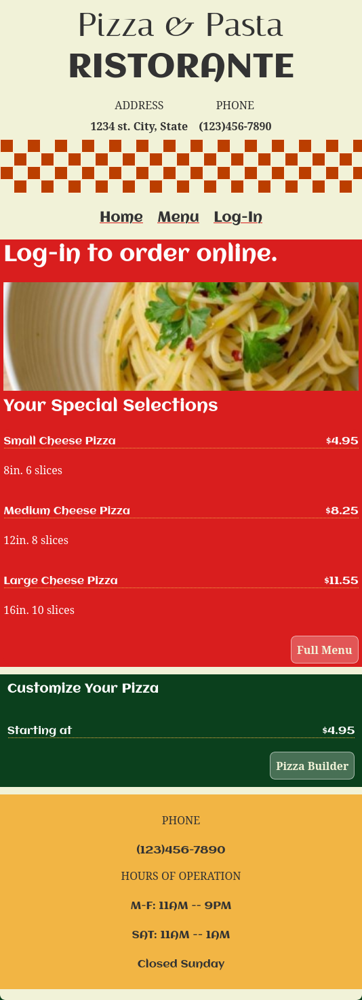                              | **Landing Page Desktop**  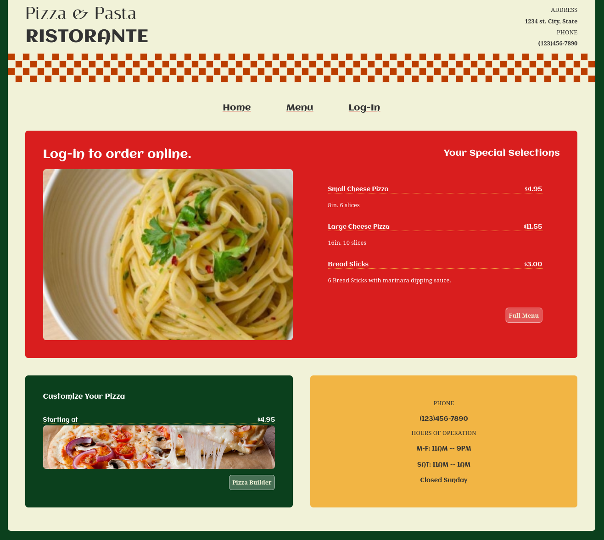                              |
| **Menu Page Mobile**  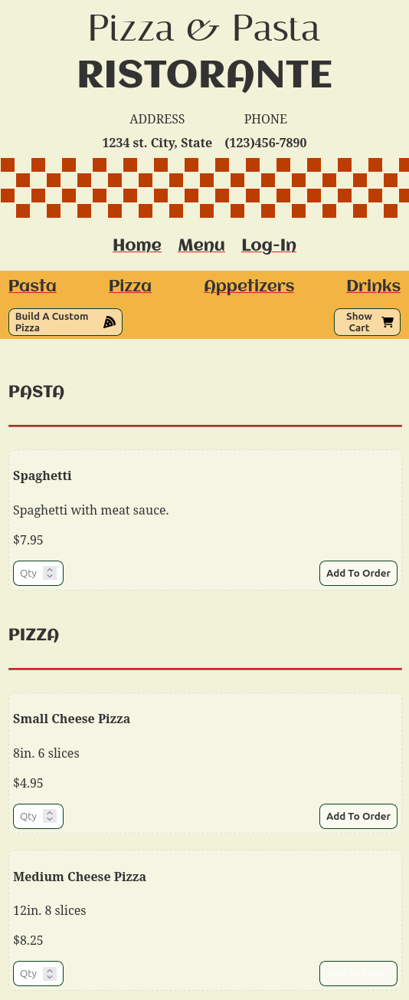                                 | **Menu Page Desktop**  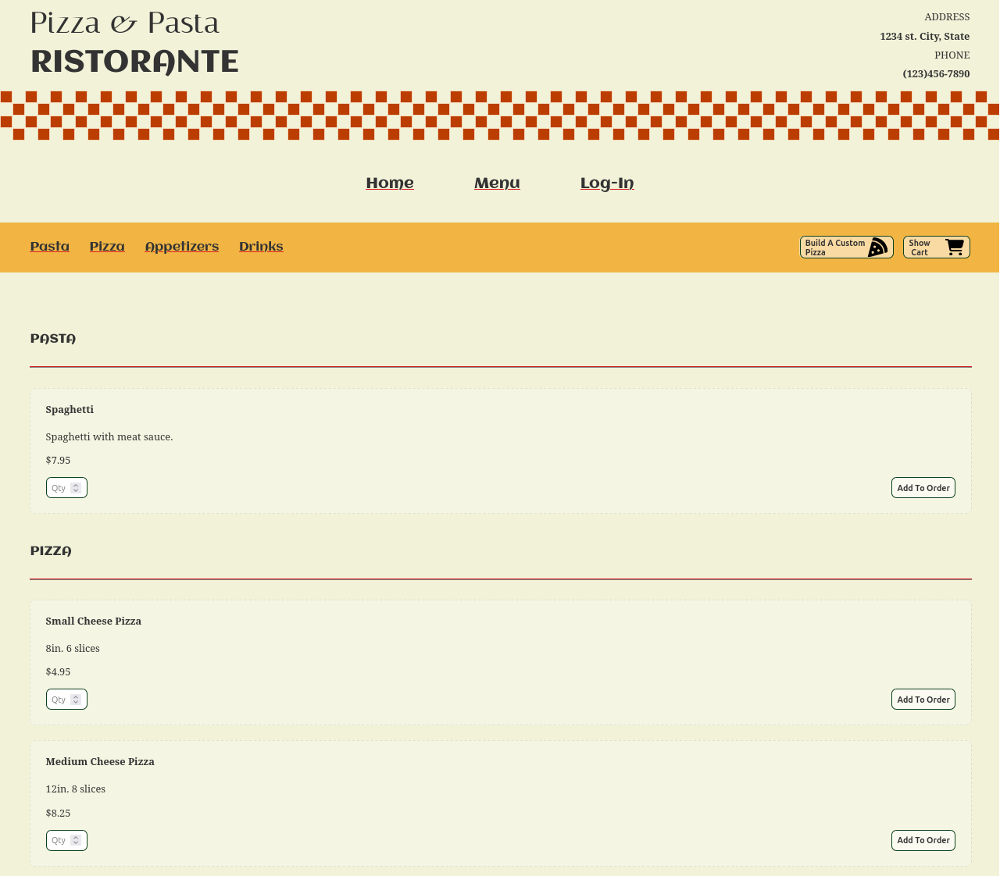                                 |
| **Pizza Builder Mobile**               | **Pizza Builder Desktop**  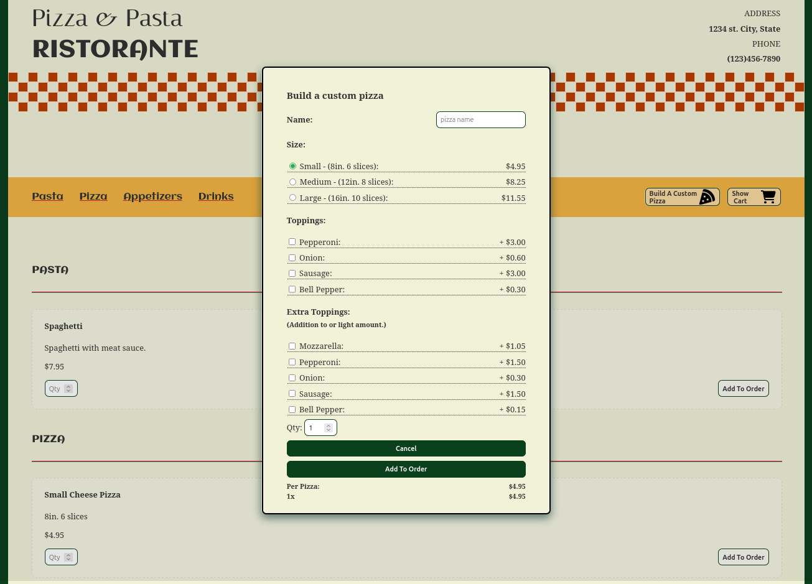             |
| **Cart Mobile**  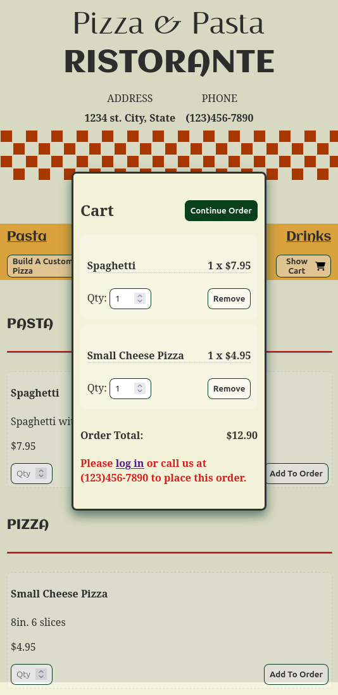                                      | **Cart Desktop**  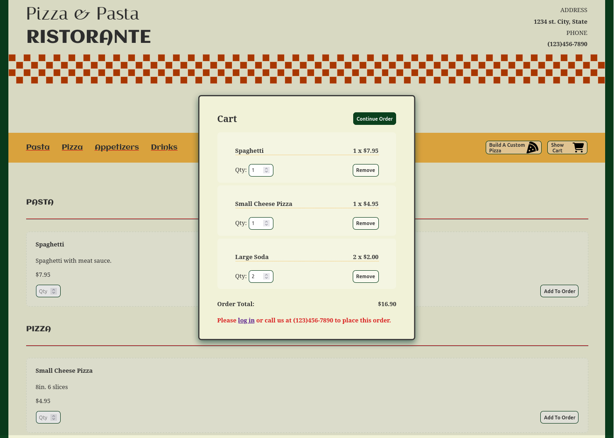                                      |
| **Receipt Mobile**  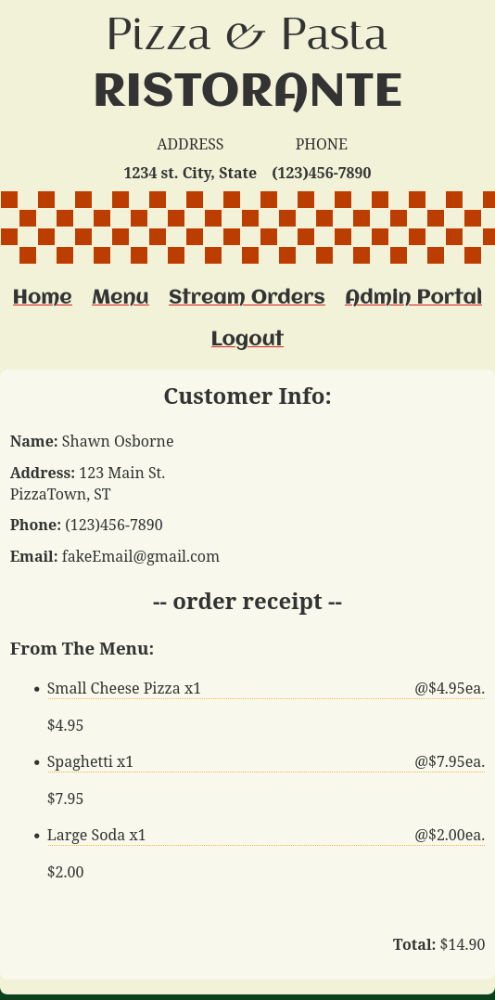                             | **Receipt Desktop**                               |
| **Admin Portal Mobile**  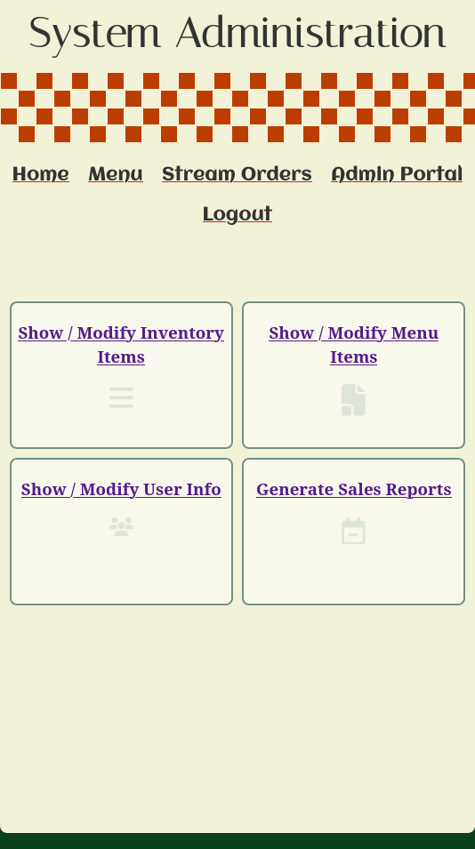               | **Admin Portal Desktop**  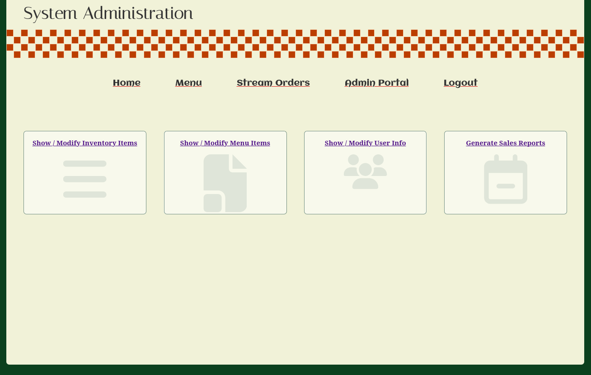               |
 | **Management Mobile**  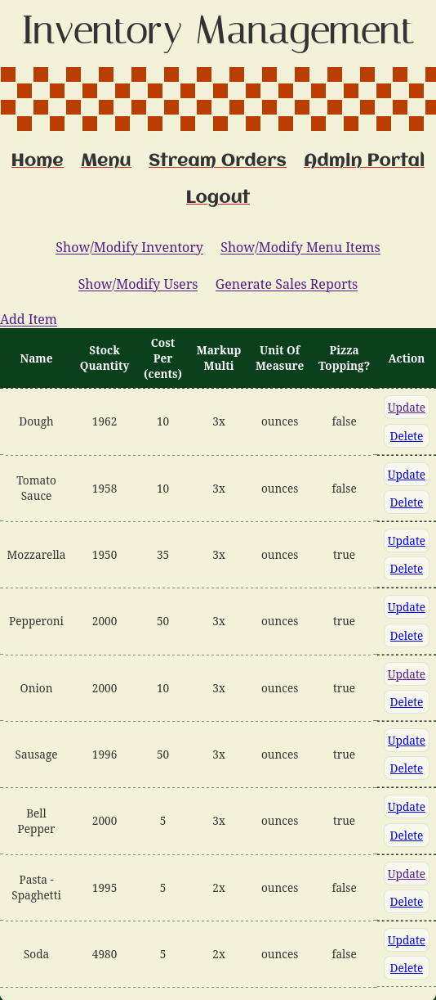 | **Management Desktop**  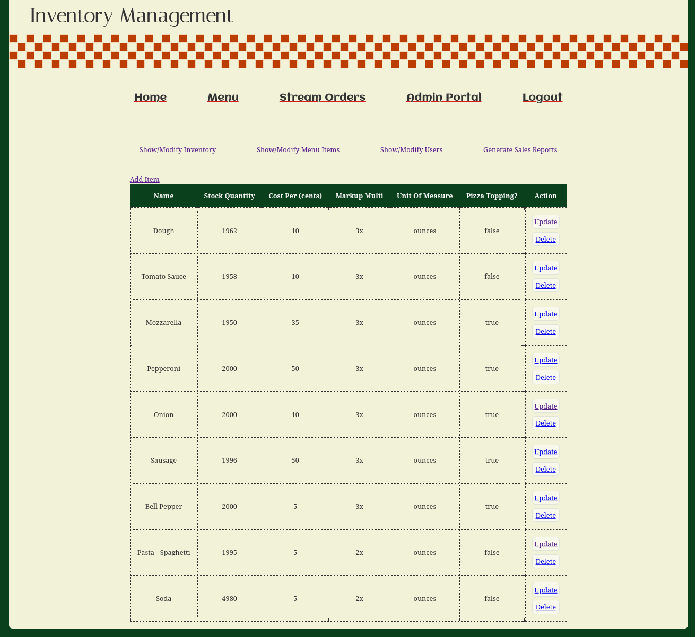 |
| **Order Fulfilment Mobile**  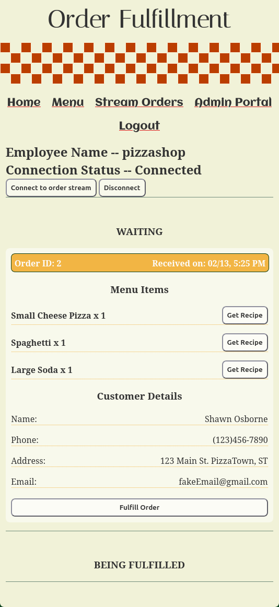  | **Order Fulfilment Desktop**  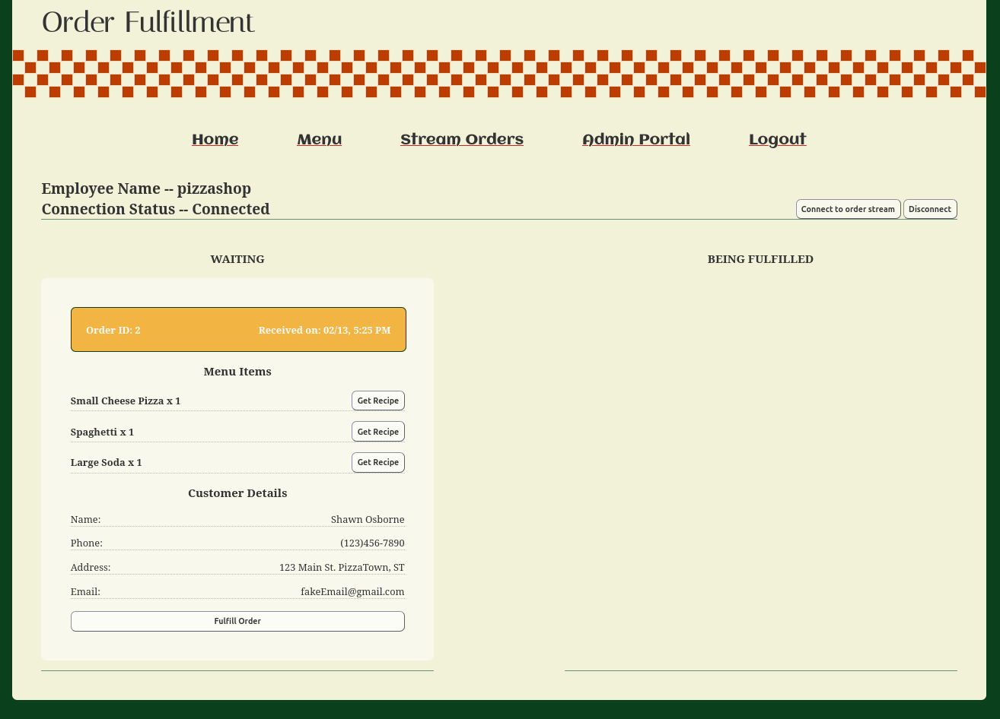  |

